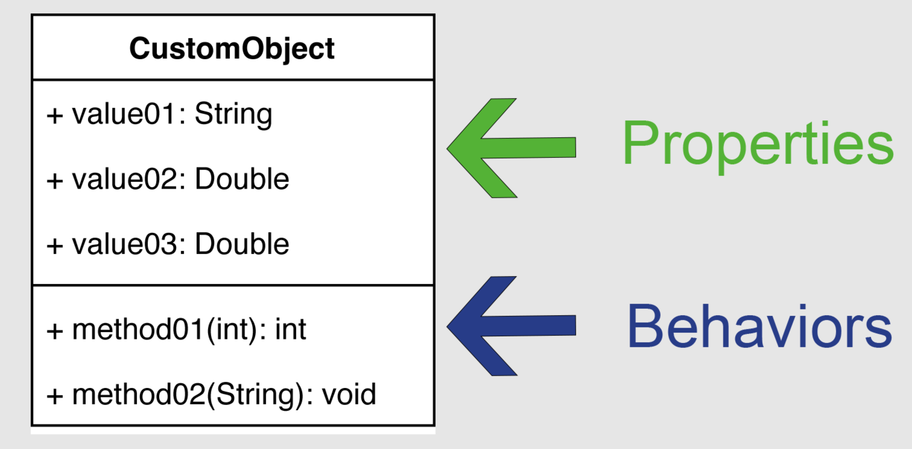
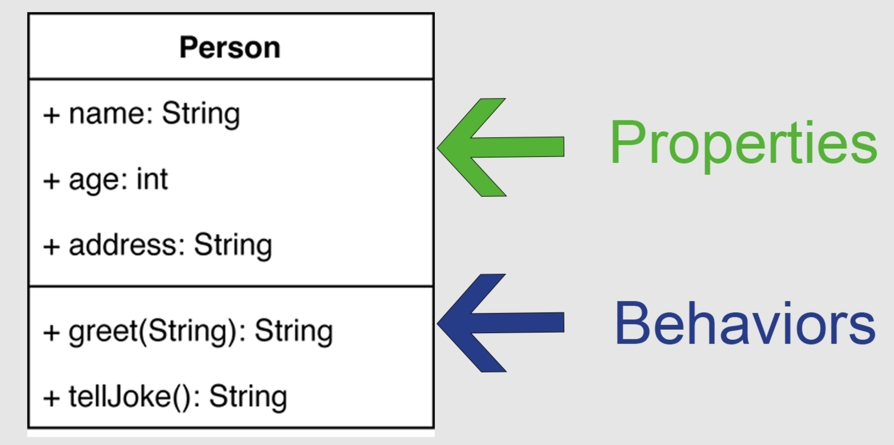
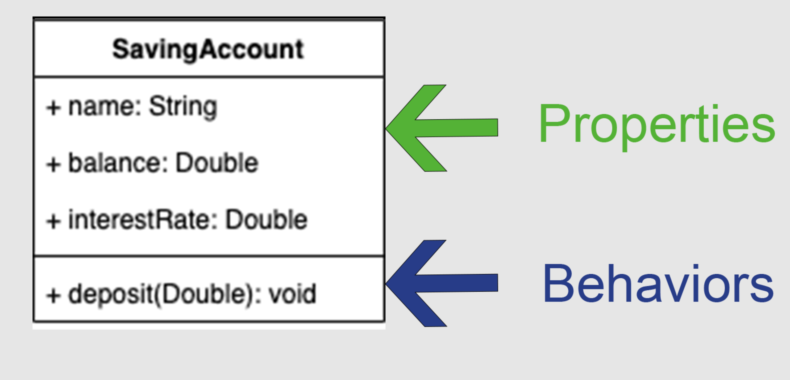
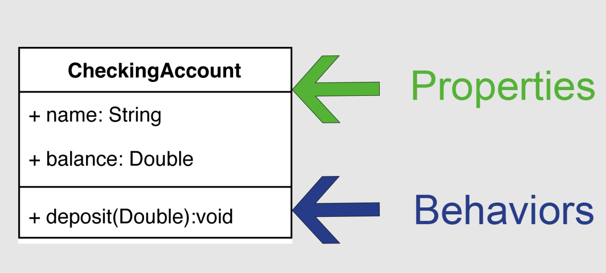
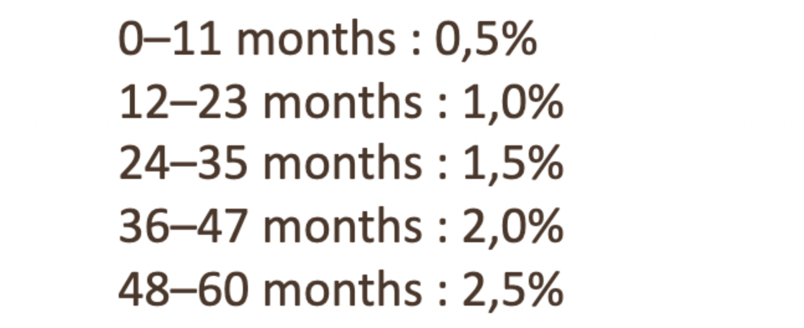

# U7S1-Creating a Class

* Part A - Foundations 7.1
* Part B - Test Driven Development
* Part C - Algorithm Challenge


## Part A

>Exercise 01 in the lecture slides requires we have Java FX installed, so we will not be doing that activity.

>JavaFx is not used a lot, and is slowly falling to the wayside. It's not even included in every version of the Java Development Kit. We installed a version of the JDK that does not include FX.

### UML

**The Unified Modeling Language (UML)** is a general-purpose, developmental, modeling language in the field of software engineering that is intended to provide a standard way to visualize the design of a system.

**Classes**: A template for creating objects and implementing behavior in a system. In UML, a class represents an object or a set of objects that share a common structure and behavior. They're represented by a rectangle that includes rows of the class name, its **properties** (attributes), and its **behaviors** (operations).



* **Properties** - are the values your object will store.
* **Behaviors** - are the actions your object can perform.

### Example 01 Person



The person class contains properties and behaviors:

* Properties ( Things the object stores )
    * name
    * age
    * address
* Behaviors (Things the object can do )
    * greet
    * tellJoke

Take a look at the `Person` class in `partA.example01`

1. Comment each line of code, and review with class.
2. Run `PersonTest` and see if what you expected to happen matches up.


### Ex 01

Below is the UML for the `SavingAccountExample` class in the `partA.ex01` package.



1. Write comments for each line in `SavingAccountExample` and review with class.
2. In the `partA.ex01` package finish the `CheckingAccount` class based on the UML below


3. Complete `CheckingAccountTest` look at `SavingAccountTest` for inspiration.


### Ex 02

* In the `partA.ex02` package complete `SavingBond` with the following requirements.
    * A person may purchase a bond for any term between 1 and 60 months
    * A bond earns interest every month until its term matures (0 months remaining)
    * The term and interest rate are set at the same time
    * The bond's interest rate is based on its term according to the following tier system.


	

1. Complete `SavingBondTest` 
2. Run your code see if what you expected to happen matches up.

## Part B

### Test Driven Development (TDD)

### What is a unit test?

* A `unit test` is a practice by which `small units of code` are tested.
* The purpose of a unit test is to determine if a feature being tested is fit for use in other parts of an application.
* It is considered best practice to test every method in an application with at least 2 sets of arguments.
* Tests are typically expressed as a combination of three clauses:
  * `Given` some context
  * `When` some action is carried out
  * `Then` consequences should be observable

### Example

```java
// Given
String name = "Tariq";
Integer age = 43;
Person person = new Person(name, age);

// When
String actuaName = person.getName();
Integer actualAge = person.getAge();

// Then
Assertertions.assertEquals(name, actuaName);
Assertions.assertEquals(age, actualAge);
```


### What are the three clauses of a test?
#### Given (some context)
* `Given` is the section of a unit test method that
  * initializes, instantiates, or sets the value of data to pass to test method.

* **Example**

```java
// Given
String name = "Tariq";
Integer age = 43;
Person leon = new Person(name, age);
```

#### When (some action is carried out)
* `When` is the section of a unit test method that
  * invokes the method with the previously arranged parameters

```java
// When
String actuaName = person.getName();
Integer actualAge = person.getAge();
```


#### Then (consequences should be observable)
* `Then` is the section of a unit test method that
  * verifies that the method to be tested behaves as expected

```java
// Then
Assertertions.assertEquals(name, actuaName);
Assertions.assertEquals(age, actualAge);
```

## Assignment

* **Objective:**
  * To create tests that ensure expected behavior of each class:
    * Cat
    * Dog
    * AnimalFactory
    * CatHouse
    * DogHouse
* **Purpose:**
  * To establish familiarity with Test-Driven-Development (TDD) practices.

#### CatTest

* Create tests for `void setName(String name)`
  * ensure that when `.setName` is invoked on an instance of `Cat`, the `name` field is being set to the respective value.
* Create tests for `setBirthDate(Date birthDate)`
  * ensure that when `.setBirthDate` is invoked on an instance of `Cat`, the `birthDate` field is being set to the respective value.
* Create tests for `String speak()`
  * ensure that when `.speak` is invoked on an instance of `Cat`, the value `"meow!"` is returned.
* Create tests for `void eat(Food food)`
  * ensure that when `.eat` is invoked on an instance of `Cat`, the `numberOfMealsEaten` is increased by 1.
* Create tests for `Integer getId()`
  * ensure that when `.getId` is invoked on an instance of `Cat`, the respective `id` value is returned.
* Create test to check Animal inheritance; google search `java instanceof keyword`
  * ensure that a `Cat` is an `instanceof` an Animal
* Create test to check Mammal inheritance; google search `java instanceof keyword`
  * ensure that a `Cat` is an `instanceof` a Mammal

#### DogTest
* Create tests for `void setName(String name)`
  * ensure that when `.setName` is invoked on an instance of `Dog`, the `name` field is being set to the respective value.
* Create tests for `setBirthDate(Date birthDate)`
  * ensure that when `.setBirthDate` is invoked on an instance of `Dog`, the `birthDate` field is being set to the respective value.
* Create tests for `String speak()`
  * ensure that when `.speak` is invoked on an instance of `Dog`, the value `"bark!"` is returned.
* Create tests for `void eat(Food food)`
  * ensure that when `.eat` is invoked on an instance of `Dog`, the `numberOfMealsEaten` is increased by 1.
* Create tests for `Integer getId()`
  * ensure that when `.getId` is invoked on an instance of `Dog`, the respective `id` value is returned.
* Create test to check Animal inheritance; google search `java instanceof keyword`
  * ensure that a `Dog` is an `instanceof` an Animal
* Create test to check Mammal inheritance; google search `java instanceof keyword`
  * ensure that a `Dog` is an `instanceof` an Mammal


#### AnimalFactoryTest
* Create Test for `Animal createDog(String name, Date birthDate)`
  * ensure that when `.createDog` is invoked on `AnimalFactoryTest` a `Dog` is created with the respective `name` and `birthDate` value.
* Create Test for `Animal createCat(String name, Date birthDate)`
  * ensure that when `.createCat` is invoked on `AnimalFactoryTest` a `Dog` is created with the respective `name` and `birthDate` value.

#### CatHouseTest
* Create tests for `void add(Cat cat)`
  * ensure that when `.add` is invoked on the `CatHouse`, a respective `Cat` object can be retrieved from the house.
* Create tests for `void remove(Cat cat)`
  * ensure that when `.remove` is invoked on the `CatHouse`, a respective `Cat` object can no longer be retrieved from the house.
* Create tests for `void remove(Integer id)`
  * ensure that when `.remove` is invoked on the `CatHouse`, a `Cat` object with the respective `id` can no longer be retrieved from the house.
* Create tests for `Cat getCatById(Integer id)`
  * ensure that when `.getCatById` is invoked on the `CatHouse`, a `Cat` with the respective `id` is returned.
* Create tests for `Integer getNumberOfCats()`
  * ensure that when `.getNumberOfCats()` is invoked on the `CatHouse`, the respective number of `Cat` objects is returned.

#### DogHouseTest
* Create tests for `void add(Dog dog)`
  * ensure that when `.add` is invoked on the `DogHouse`, a respective `Dog` object can be retrieved from the house.
* Create tests for `void remove(Integer id)`
  * ensure that when `.remove` is invoked on the `DogHouse`, a respective `Dog` object can no longer be retrieved from the house.
* Create tests for `void remove(Dog dog)`
  * ensure that when `.remove` is invoked on the `DogHouse`, a `Dog` object with the respective `id` can no longer be retrieved from the house.
* Create tests for `Dog getDogById(Integer id)`
  * ensure that when `.getCatById` is invoked on the `DogHouse`, a `Dog` with the respective `id` is returned.
* Create tests for `Integer getNumberOfDogs()`
  * ensure that when `.getNumberOfDogs()` is invoked on the `DogHouse`, the respective number of `Dog` objects is returned.

## Part C

### Problem 1
An upcoming artist's concert is coming to town.
The concert manager is only allowing one person of a pair to be a "teen".
Your at the front gate checking tickets and verifying ages.
You allowed to let a pair in as long as only one person is a teen but both can't be a "teen".
A "teen" is considered someone within the range of 13...19 inclusive.

Return true if one or the other person in the pair is a teen, but not both.

Example:
```java
oneTeen(13, 99) --> true
oneTeen(21, 19) --> true
oneTeen(13, 13) --> false
```
### Problem 2
We're on the look-out for ounces "oz" within a string. You will be given a string,
and you need to determine if the first two characters yields "oz".
We need you to return a new string made of the first 2 chars (if present).

Only include first char if it is 'o' and only include second char if it is 'z'.

Example:
```java
beginWithOz("ozymandias") --> "oz"
beginWithOz("bzoo") --> "z"
beginWithOz("oxx") --> "o"
```
